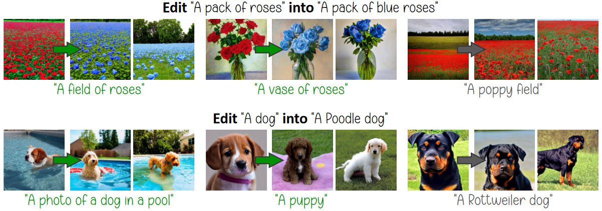

# Editing Implicit Assumptions in Text-to-Image Diffusion Models

[arXiv](https://arxiv.org/abs/???) | [PDF](https://time-diffusion.github.io/TIME_paper.pdf) | [Website](https://time-diffusion.github.io/)

[Hadas Orgad](https://orgadhadas.github.io/)<sup>\*</sup>, [Bahjat Kawar](https://bahjat-kawar.github.io/)<sup>\*</sup>, and [Yonatan Belinkov](https://www.cs.technion.ac.il/~belinkov/), Technion.<br />
<sup>*</sup> Equal Contribution.

We introduce TIME (Text-to-Image Model Editing), a method for editing implicit assumptions in text-to-image diffusion models.



## Dependencies Setup

This repo was tested with PyTorch 1.13.1, CUDA 11.6.2, Numpy 1.23.4, and Diffusers 0.9.0.

An example environment is given in `environment.yml`.

## Running the Experiments

The general command to apply TIME and see results:
```
python apply_time.py {--with_to_k} {--with_augs} --train_func {TRAIN_FUNC} --lamb {LAMBDA} --save_dir {SAVE_DIR} --dataset {DATASET} --begin_idx {BEGIN} --end_idx {END} --num_seeds {SEEDS}
```
where the following are options
- `--with_to_k` whether to edit the key projection matrix along with the value projection matrix.
- `--with_augs` whether to apply textual augmentations for editing.
- `TRAIN_FUNC` the name of the editing function to use (`train_closed_form` or `baseline`).
- `LAMBDA` the regularization hyperparameter to be used in `train_closed_form` (default: `0.1`).
- `SAVE_DIR` the directory name to save into.
- `DATASET` the dataset csv file name (default: `TIMED_test_set_filtered_SD14.csv`).
- `BEGIN` the index to begin from in the dataset (inclusive).
- `END` the index to end on in the dataset (exclusive).
- `SEEDS` the number of seeds to generate images for in each prompt.

For example, for applying the main experiment on TIMED presented in the paper:
```
python apply_time.py --with_to_k --with_augs --train_func train_closed_form --lamb 0.1 --save_dir results --begin_idx 0 --end_idx 104 --num_seeds 24
```

## References and Acknowledgements
```
@article{orgad2023editing,
    title={Editing Implicit Assumptions in Text-to-Image Diffusion Models},
    author={Orgad, Hadas and Kawar, Bahjat and Belinkov, Yonatan},
    journal={arXiv:2303.?????},
    year={2023}
}
```

This implementation is inspired by:
- [Prompt-to-Prompt Repo](https://github.com/google/prompt-to-prompt)
- [HuggingFace Diffusers](https://github.com/huggingface/diffusers)